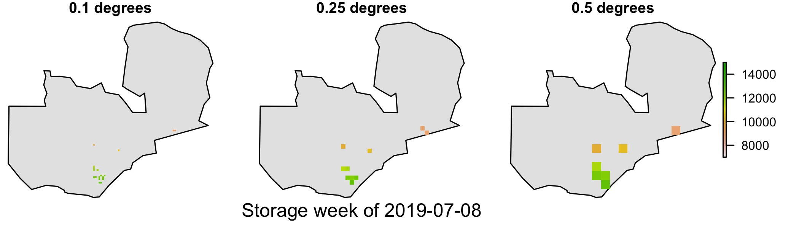

```{r setup, include = FALSE}
knitr::opts_chunk$set(
  collapse = TRUE,
  comment = "#>"
)
```

This example uses the SMS household dataset, which is not shared here because of personally identifiable information. 

```{r, eval=FALSE}
library(rastertemplate)
library(sf)
library(tidyverse)

# get Zambia
zambia <- st_as_sf(rnaturalearthdata::countries110) %>% filter(sov_a3 == "ZMB")

# Get extent from mswep grid
mswep <- read_sf("external/data/MSWEP_Zambia_Polygon.shp")

# read in farmer data and drop Z dimension from points (for rasterizing)
sms <- read_sf("external/data/SMS_Rain_Polygon.shp") %>% st_zm() %>% 
  rename(storage = DATA_VALUE) %>% 
  dplyr::select(SMS_ID, Week, Date_Time, Rain, storage) %>% 
  select_all(tolower)
# sms$geometry
# sms %>% as_tibble %>% slice(1) %>% select(-contact_Na) %>% unlist
# names(dat)
# unique(dat$flow2)

# define 3 templates of different extent
r01 <- raster_template(raster::extent(mswep), cellsize = 0.1)
r25 <- raster_template(raster::extent(mswep), cellsize = 0.25)
r5 <- raster_template(raster::extent(mswep), cellsize = 0.5)

# rasterize storage for each of the three resolutions for each week
weeks <- unique(sms$week)
storage_list <- lapply(list(r01, r25, r5), function(x) {  # x <- r01
  l <- lapply(weeks, function(y) {  # y <- unique(sms$Week)[1]
    val <- sms %>% filter(week == y) %>% select(storage)
    raster::rasterize(x = val, y = x, field = "storage")  
  })
  s <- raster::stack(l)
  raster::setZ(s, weeks)
  s
})
```

A look at three resolutions
```{r, eval=FALSE}
weeks <- unique(sms$week)
resv <- c("0.1", "0.25", "0.5")
legs <- c(FALSE, FALSE, TRUE)
png(here::here("vignettes/figures/storage_map.png"), height = 2, width = 7, 
    res = 300, units = "in")
par(mfrow = c(1, 3), oma = c(0, 0, 0, 3), mar = c(1.5, 0, 1, 2))
for(i in 1:3) {
  plot(st_geometry(zambia), col = "grey90", main = paste(resv[i], "degrees"))
  if(i == 2) mtext(paste("Storage week of", weeks[177]), side = 1, line = 0)
  raster::plot(storage_list[[i]][[177]], zlim = c(7000, 15000), add = TRUE, 
               legend = legs[i])
}  
dev.off()
```

```{r, echo = FALSE, out.width="100%"}

```

